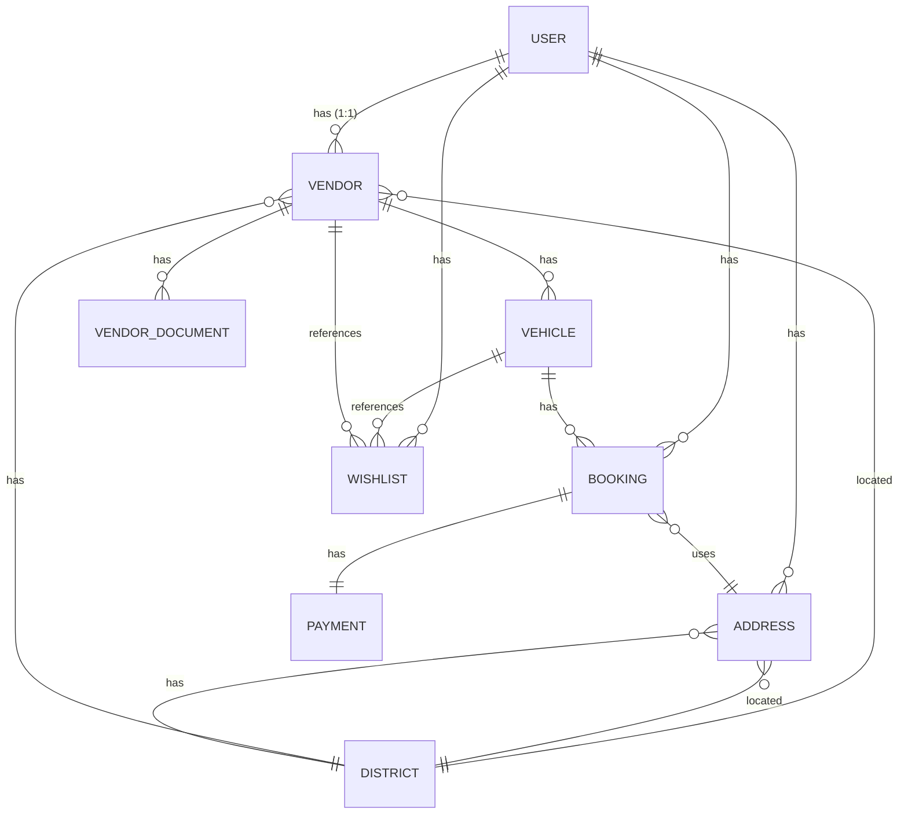

# 🏍️ RenMote — Platform Marketplace Rental Motor

[](https://laravel.com)
[](https://php.net)
[](https://tailwindcss.com)
[](https://vitejs.dev)
[](https://mysql.com)
[](https://midtrans.com)

**RenMote** adalah platform marketplace rental motor modern berbasis web yang mempertemukan penyedia rental (Vendor) dengan pelanggan (User/Customer) secara aman, praktis, dan real-time. Dilengkapi dengan dashboard admin yang komprehensif, platform ini mencakup seluruh siklus bisnis rental motor mulai dari pendaftaran vendor, verifikasi dokumen, pencarian kendaraan berbasis wilayah, pemesanan, pembayaran otomatis (Midtrans DP 30%), hingga sistem notifikasi terpadu.

---

## 🚀 Fitur Utama

### 1. Pelanggan (User/Customer)
*   **Autentikasi Modern**: Pendaftaran & login akun dengan verifikasi OTP (SMS/WhatsApp) serta opsi **Google OAuth (Google Sign-In)**.
*   **Pencarian Cerdas**: Cari motor berdasarkan kata kunci, kategori kendaraan, wilayah (District), serta ketersediaan tanggal sewa.
*   **Wishlist & Favorit**: Simpan motor dan vendor favorit untuk akses cepat di kemudian hari.
*   **Sewa Fleksibel (DP 30%)**: Lakukan booking dengan sistem Down Payment sebesar 30% dari total biaya sewa.
*   **Pembayaran Otomatis & Manual**: Integrasi langsung dengan **Midtrans** (E-Wallet, Transfer Bank otomatis) atau metode transfer bank manual dengan mengunggah bukti transfer.
*   **Notifikasi Real-time**: Dapatkan pemberitahuan via email (terlampir Invoice PDF) dan notifikasi in-app untuk setiap status pemesanan.

### 2. Penyedia Rental (Vendor)
*   **Pendaftaran Mandiri**: Pengguna biasa dapat mengajukan diri menjadi vendor dengan melengkapi profil toko dan bank payout.
*   **Sistem Verifikasi Dokumen**: Keamanan transaksi dengan kewajiban mengunggah dokumen KTP (wajib), surat izin operasional, serta foto toko.
*   **Manajemen Inventaris (CRUD Motor)**: Kelola unit motor dengan detail kategori, harga sewa per hari, tahun motor, kapasitas mesin (cc), stok unit, serta unggahan foto kendaraan.
*   **Pengolahan Booking**: Terima, tolak, atau selesaikan pesanan dari pelanggan, serta kelola bukti transfer manual.
*   **Booking Offline (Manual)**: Buat pemesanan manual secara mandiri untuk pelanggan offline.
*   **Export Data**: Unduh laporan pemesanan langsung ke dalam file format **Excel (XLSX)**.

### 3. Pengelola Sistem (Admin)
*   **Dashboard Analytics**: Statistik ringkas jumlah pengguna, vendor aktif, total motor, serta transaksi terbaru.
*   **Moderasi Vendor**: Sistem peninjauan dokumen pendaftaran vendor (Approve/Reject dengan alasan penolakan).
*   **Manajemen Keamanan Dokumen**: File dokumen KTP vendor disimpan secara privat dan hanya dapat diakses admin menggunakan temporary signed URL.

---

## 🛠️ Tech Stack

| Komponen | Teknologi |
| :--- | :--- |
| **Backend Framework** | Laravel 12.0 (PHP ^8.2) |
| **Frontend Framework** | Blade Templates + Alpine.js |
| **Styling & CSS** | Tailwind CSS + Custom Design System |
| **Build Tool** | Vite 7.0 |
| **Database** | MySQL / MariaDB |
| **Payment Gateway** | Midtrans SNAP API (E-wallet, Virtual Account, Credit Card) |
| **Authentication** | Laravel Breeze & Laravel Socialite |
| **PDF Engine** | Barryvdh Laravel DomPDF (Untuk Cetak Invoice) |
| **Excel Export** | Maatwebsite Excel |

---

## 📊 Rancangan Basis Data (ERD)

Struktur relasi tabel pada database **RenMote** dirancang menggunakan diagram berikut:



---

## ⚙️ Panduan Instalasi & Penggunaan

### Prasyarat (Prerequisites)
Pastikan kamu telah menginstal perkakas berikut pada sistem operasi lokalmu:
*   PHP >= 8.2
*   Composer (Dependency Manager PHP)
*   Node.js (NPM) >= 18.x
*   MySQL Server

### Langkah-Langkah Pemasangan
1.  **Clone Repository**:
    ```bash
    git clone https://github.com/imojan/renmote.git
    cd renmote
    ```

2.  **Jalankan Perintah Setup Otomatis**:
    Proyek ini telah dikonfigurasi dengan perintah instalasi sekali jalan menggunakan Composer:
    ```bash
    composer setup
    ```
    *Perintah di atas secara otomatis akan menginstal dependensi PHP & JS, menyalin berkas konfigurasi `.env`, men-generate App Key, memigrasi database, serta me-build aset frontend.*

3.  **Sesuaikan Konfigurasi `.env`**:
    Buka berkas `.env` baru milikmu dan lengkapi detail berikut sesuai kredensial lokalmu:
    ```env
    DB_DATABASE=nama_database_kamu
    DB_USERNAME=root
    DB_PASSWORD=

    # Midtrans Configuration
    MIDTRANS_MERCHANT_ID=
    MIDTRANS_CLIENT_KEY=
    MIDTRANS_SERVER_KEY=
    MIDTRANS_IS_PRODUCTION=false

    # Google Socialite Configuration
    GOOGLE_CLIENT_ID=
    GOOGLE_CLIENT_SECRET=
    GOOGLE_REDIRECT_URI="${APP_URL}/auth/google/callback"
    ```

4.  **Migrasi & Seed Data Awal (Opsional)**:
    Jika ingin memigrasi ulang serta menyisipkan data dummy untuk pengujian, jalankan:
    ```bash
    php artisan migrate:fresh --seed
    ```

### Menjalankan Server Pengembangan (Local Dev Server)
Kamu dapat menjalankan web server Laravel beserta bundler Vite sekaligus hanya dengan satu perintah:
```bash
composer dev
```
Buka peramban (browser) dan akses alamat **`http://localhost:8000`** (atau port server Laravel yang ditunjuk).

---

## 🔑 Kredensial Uji Coba (Dummy Accounts)

Gunakan akun berikut untuk menguji berbagai modul hak akses (Role-based Access) pada database seeder:

| Role | Email | Password |
| :--- | :--- | :--- |
| **Admin** | `admin@example.com` | `AdminPassword123` |
| **Vendor** | `dummy_vendor@example.com` | `DummyPassword123` |
| **User / Customer** | `dummy_user@example.com` | `DummyPassword123` |

---

## 📄 Lisensi

Platform RenMote dirancang untuk kepentingan pembelajaran, pengerjaan Tugas Akhir, serta pengembangan internal. Lisensi open-source didasarkan pada [MIT License](LICENSE).
