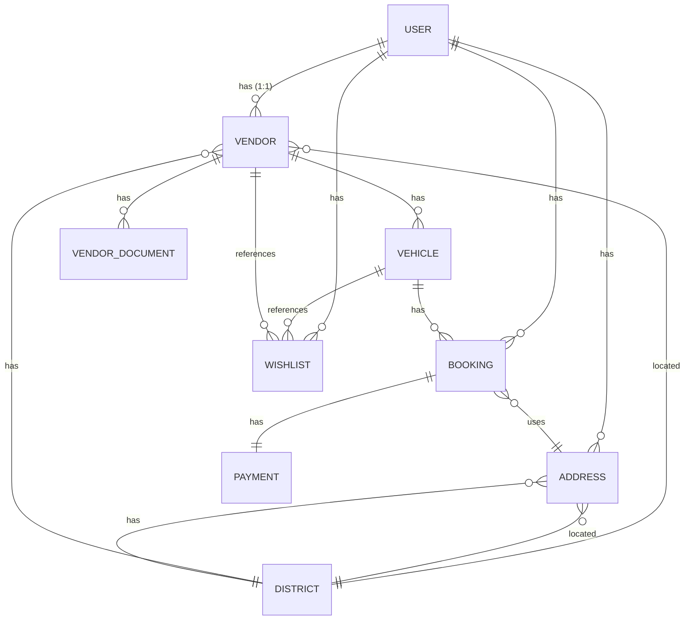

# Class Diagram - Platform Marketplace Rental Motor RenMote

## 1. Class Diagram Keseluruhan



---

## 2. Class Diagram Detail (UML)

```mermaid
classDiagram
    class User {
        <<Entity>>
        - id: int
        - name: string
        - username: string
        - email: string
        - password: string
        - role: enum[user, vendor, admin]
        - phone_number: string
        - gender: enum[male, female]
        - birth_date: date
        - profile_photo_path: string
        - is_phone_verified: boolean
        - remember_token: string
        - created_at: timestamp
        - updated_at: timestamp
        - deleted_at: timestamp (nullable)
        + login()
        + logout()
        + updateProfile()
        + verifyPhone()
        + resetPassword()
        + getAddresses()
        + getBookings()
        + getWishlist()
    }

    class Vendor {
        <<Entity>>
        - id: int
        - user_id: int (FK)
        - district_id: int (FK)
        - store_name: string
        - description: text
        - phone: string
        - address: string
        - bank_name: string
        - bank_account: string
        - profile_photo: string
        - cover_photo: string
        - rating: decimal(3,2)
        - rating_count: int
        - status: enum[pending, approved, rejected]
        - verified: boolean
        - rejection_reason: text (nullable)
        - created_at: timestamp
        - updated_at: timestamp
        - deleted_at: timestamp (nullable)
        + registerVendor()
        + uploadDocuments()
        + getVehicles()
        + getBookings()
        + confirmBooking()
        + completeBooking()
        + updateProfile()
        + updateBankInfo()
    }

    class District {
        <<Entity>>
        - id: int
        - name: string
        - created_at: timestamp
        - updated_at: timestamp
        + getVendors()
        + getAddresses()
    }

    class Vehicle {
        <<Entity>>
        - id: int
        - vendor_id: int (FK)
        - name: string
        - category: enum[matic, manual, sport, bebek, trail, skutik_premium, bigbike]
        - price_per_day: decimal(10,2)
        - year: int
        - engine_cc: int
        - description: text
        - image: string
        - stock: int
        - status: enum[available, unavailable]
        - created_at: timestamp
        - updated_at: timestamp
        + getVendor()
        + getBookings()
        + checkAvailability(start_date, end_date)
        + updatePrice()
        + updateStock()
        + getWishlistCount()
    }

    class Booking {
        <<Entity>>
        - id: int
        - user_id: int (FK)
        - vehicle_id: int (FK)
        - address_id: int (FK, nullable)
        - start_date: date
        - end_date: date
        - total_price: decimal(10,2)
        - status: enum[pending, confirmed, completed, cancelled]
        - source: enum[online, manual]
        - customer_name: string (nullable)
        - customer_phone: string (nullable)
        - fulfillment_method: string
        - walkin_notes: text (nullable)
        - delivery_address_snapshot: json
        - created_at: timestamp
        - updated_at: timestamp
        + calculateDays()
        + calculateTotalPrice()
        + confirmBooking()
        + completeBooking()
        + cancelBooking()
        + getPayment()
        + generateInvoice()
    }

    class Payment {
        <<Entity>>
        - id: int
        - booking_id: int (FK)
        - amount: decimal(10,2)
        - payment_type: enum[dp, full]
        - status: enum[pending, paid, failed, cancelled]
        - gateway_status: string
        - gateway_payment_type: string
        - gateway_transaction_id: string
        - gateway_last_synced_at: timestamp (nullable)
        - gateway_payload: json
        - provider: enum[midtrans, manual]
        - payment_method: enum[gopay, ovo, dana, transfer]
        - invoice_number: string
        - snap_token: string (nullable)
        - expires_at: timestamp (nullable)
        - paid_at: timestamp (nullable)
        - proof_path: string (nullable)
        - proof_notes: text (nullable)
        - proof_status: enum[pending, approved, rejected]
        - proof_review_notes: text (nullable)
        - proof_uploaded_at: timestamp (nullable)
        - proof_reviewed_at: timestamp (nullable)
        - created_at: timestamp
        - updated_at: timestamp
        + processPayment()
        + verifyPayment()
        + uploadPaymentProof()
        + approvePaymentProof()
        + rejectPaymentProof()
        + generateInvoice()
    }

    class Address {
        <<Entity>>
        - id: int
        - user_id: int (FK)
        - district_id: int (FK)
        - label: string
        - address_type: enum[home, office, other]
        - street: text
        - city: string
        - postal_code: string
        - lat: decimal(10,7)
        - lng: decimal(10,7)
        - is_default: boolean
        - created_at: timestamp
        - updated_at: timestamp
        + setAsDefault()
        + getDistrict()
        + getBookings()
    }

    class VendorDocument {
        <<Entity>>
        - id: int
        - vendor_id: int (FK)
        - type: enum[ktp, permit, photo]
        - file_path: string
        - status: enum[pending, approved, rejected]
        - notes: text (nullable)
        - created_at: timestamp
        - updated_at: timestamp
        + uploadDocument()
        + approveDocument()
        + rejectDocument()
        + getSignedUrl()
    }

    class Wishlist {
        <<Entity>>
        - id: int
        - user_id: int (FK)
        - wishlistable_type: string (Vehicle|Vendor)
        - wishlistable_id: int
        - created_at: timestamp
        - updated_at: timestamp
        + addToWishlist()
        + removeFromWishlist()
        + getWishlistItems()
    }

    class Notification {
        <<Entity>>
        - id: int
        - user_id: int (FK)
        - type: string
        - title: string
        - message: string
        - data: json
        - is_read: boolean
        - created_at: timestamp
        - updated_at: timestamp
        + markAsRead()
        + sendEmail()
    }

    %% Relationships
    User "1" -- "0..1" Vendor : "has"
    User "1" -- "*" Address : "has"
    User "1" -- "*" Booking : "has"
    User "1" -- "*" Wishlist : "has"
    User "1" -- "*" Notification : "receives"
    Vendor "1" -- "*" Vehicle : "has"
    Vendor "1" -- "*" VendorDocument : "has"
    Vendor "*" -- "1" District : "located in"
    Vehicle "1" -- "*" Booking : "can be booked"
    Vehicle "1" -- "*" Wishlist : "can be wishlisted"
    Vendor "1" -- "*" Wishlist : "can be wishlisted"
    Booking "1" -- "1" Payment : "has"
    Booking "*" -- "1" Address : "uses"
    Address "*" -- "1" District : "located in"
    District "1" -- "*" Vendor : "has"
    District "1" -- "*" Address : "has"
```



---

## 3. Penjelasan Setiap Class

### 3.1 **User Class**
**Deskripsi:** Merepresentasikan pengguna sistem yang dapat berfungsi sebagai user biasa, vendor, atau admin.

**Atribut Utama:**
- `id`: Identitas unik user
- `name`: Nama lengkap user
- `email`: Email user (unique)
- `password`: Password ter-enkripsi
- `role`: Peran user dalam sistem (user, vendor, admin)
- `phone_number`: Nomor telepon user
- `is_phone_verified`: Status verifikasi nomor HP via OTP

**Relasi:**
- 1:1 dengan Vendor (user dapat menjadi vendor)
- 1:* dengan Address (user dapat memiliki banyak alamat)
- 1:* dengan Booking (user dapat membuat banyak booking)
- 1:* dengan Wishlist (user dapat membuat banyak wishlist)
- 1:* dengan Notification (user menerima notifikasi)

**Method Utama:**
- `login()`: Proses login user
- `verifyPhone()`: Verifikasi nomor HP dengan OTP
- `getBookings()`: Ambil daftar booking user
- `getWishlist()`: Ambil daftar wishlist user

---

### 3.2 **Vendor Class**
**Deskripsi:** Merepresentasikan penyedia layanan rental yang mempunyai kendaraan.

**Atribut Utama:**
- `user_id`: Foreign key ke User
- `store_name`: Nama toko/usaha vendor
- `status`: Status vendor (pending, approved, rejected)
- `verified`: Status verifikasi dokumen
- `bank_account`: Rekening bank untuk payout
- `rating`: Rating vendor (0-5)

**Relasi:**
- *:1 dengan User (vendor dimiliki satu user)
- 1:* dengan Vehicle (vendor memiliki banyak kendaraan)
- 1:* dengan VendorDocument (vendor punya dokumen verifikasi)
- *:1 dengan District (vendor berada di satu district)

**Method Utama:**
- `registerVendor()`: Daftar sebagai vendor
- `uploadDocuments()`: Upload dokumen verifikasi
- `getBookings()`: Ambil daftar booking
- `confirmBooking()`: Konfirmasi booking dari user
- `completeBooking()`: Tandai booking selesai

---

### 3.3 **Vehicle Class**
**Deskripsi:** Merepresentasikan kendaraan yang tersedia untuk disewa.

**Atribut Utama:**
- `vendor_id`: Foreign key ke Vendor
- `name`: Nama kendaraan
- `category`: Kategori (matic, sport, bebek, trail, bigbike, dll)
- `price_per_day`: Harga sewa per hari
- `year`: Tahun pembuatan
- `stock`: Jumlah unit yang tersedia
- `status`: Status ketersediaan (available/unavailable)

**Relasi:**
- *:1 dengan Vendor (vehicle milik satu vendor)
- 1:* dengan Booking (vehicle dapat di-booking multiple times)
- 1:* dengan Wishlist (vehicle dapat di-wishlist multiple users)

**Method Utama:**
- `checkAvailability(start_date, end_date)`: Cek ketersediaan di rentang tanggal
- `getBookings()`: Ambil daftar booking untuk kendaraan ini
- `updateStock()`: Update jumlah stok

---

### 3.4 **Booking Class**
**Deskripsi:** Merepresentasikan pesanan/pemesanan kendaraan oleh user.

**Atribut Utama:**
- `user_id`: Foreign key ke User
- `vehicle_id`: Foreign key ke Vehicle
- `start_date`: Tanggal mulai sewa
- `end_date`: Tanggal kembali
- `total_price`: Total harga sewa
- `status`: Status booking (pending, confirmed, completed, cancelled)
- `source`: Sumber booking (online, manual)

**Relasi:**
- *:1 dengan User (booking dibuat user)
- *:1 dengan Vehicle (booking untuk vehicle tertentu)
- 1:1 dengan Payment (booking memiliki satu payment record)
- *:1 dengan Address (booking menggunakan alamat pengambilan)

**Method Utama:**
- `calculateDays()`: Hitung jumlah hari sewa
- `calculateTotalPrice()`: Hitung total harga
- `confirmBooking()`: Konfirmasi booking
- `cancelBooking()`: Batalkan booking
- `generateInvoice()`: Buat invoice

---

### 3.5 **Payment Class**
**Deskripsi:** Merepresentasikan transaksi pembayaran untuk booking.

**Atribut Utama:**
- `booking_id`: Foreign key ke Booking
- `amount`: Jumlah pembayaran
- `payment_type`: Tipe pembayaran (dp=30%, full)
- `status`: Status pembayaran (pending, paid, failed)
- `provider`: Provider pembayaran (midtrans, manual)
- `payment_method`: Metode pembayaran (gopay, ovo, dana, transfer)
- `proof_status`: Status bukti transfer (pending, approved, rejected)

**Relasi:**
- *:1 dengan Booking (payment terhubung ke satu booking)

**Method Utama:**
- `processPayment()`: Proses pembayaran
- `verifyPayment()`: Verifikasi pembayaran dengan gateway
- `uploadPaymentProof()`: Upload bukti pembayaran
- `approvePaymentProof()`: Terima bukti pembayaran
- `generateInvoice()`: Buat invoice pembayaran

---

### 3.6 **Address Class**
**Deskripsi:** Merepresentasikan alamat user untuk pengambilan dan pengantaran.

**Atribut Utama:**
- `user_id`: Foreign key ke User
- `district_id`: Foreign key ke District
- `label`: Label alamat (Rumah, Kantor, dll)
- `street`: Alamat jalan
- `city`: Kota
- `postal_code`: Kode pos
- `lat`, `lng`: Koordinat GPS
- `is_default`: Apakah alamat default

**Relasi:**
- *:1 dengan User (address milik user)
- *:1 dengan District (address berada di district)
- 1:* dengan Booking (address dapat digunakan multiple bookings)

**Method Utama:**
- `setAsDefault()`: Set sebagai alamat default
- `getDistrict()`: Ambil info district
- `getBookings()`: Ambil booking yang menggunakan alamat ini

---

### 3.7 **VendorDocument Class**
**Deskripsi:** Merepresentasikan dokumen verifikasi vendor (KTP, surat izin, foto toko).

**Atribut Utama:**
- `vendor_id`: Foreign key ke Vendor
- `type`: Tipe dokumen (ktp, permit, photo)
- `file_path`: Path file di storage
- `status`: Status dokumen (pending, approved, rejected)
- `notes`: Catatan dari admin

**Relasi:**
- *:1 dengan Vendor (dokumen milik vendor)

**Method Utama:**
- `uploadDocument()`: Upload dokumen baru
- `approveDocument()`: Approve dokumen oleh admin
- `rejectDocument()`: Reject dokumen
- `getSignedUrl()`: Dapatkan temporary signed URL untuk akses aman

---

### 3.8 **District Class**
**Deskripsi:** Merepresentasikan lokasi/distrik untuk vendor dan address.

**Atribut Utama:**
- `id`: Identitas district
- `name`: Nama district

**Relasi:**
- 1:* dengan Vendor (district memiliki banyak vendor)
- 1:* dengan Address (district memiliki banyak address)

**Method Utama:**
- `getVendors()`: Ambil semua vendor di district ini
- `getAddresses()`: Ambil semua address di district ini

---

### 3.9 **Wishlist Class**
**Deskripsi:** Merepresentasikan item wishlist user (menggunakan Polymorphic Relationship).

**Atribut Utama:**
- `user_id`: Foreign key ke User
- `wishlistable_type`: Tipe target (Vehicle atau Vendor)
- `wishlistable_id`: ID target (vehicle_id atau vendor_id)

**Relasi:**
- *:1 dengan User (wishlist milik user)
- Polymorphic relationship dengan Vehicle atau Vendor

**Method Utama:**
- `addToWishlist()`: Tambah ke wishlist
- `removeFromWishlist()`: Hapus dari wishlist
- `getWishlistItems()`: Ambil semua item wishlist

---

### 3.10 **Notification Class**
**Deskripsi:** Merepresentasikan notifikasi sistem untuk user.

**Atribut Utama:**
- `user_id`: Foreign key ke User
- `type`: Tipe notifikasi (booking_confirmed, payment_success, dll)
- `title`: Judul notifikasi
- `message`: Pesan notifikasi
- `data`: Data tambahan (json)
- `is_read`: Status pembacaan

**Relasi:**
- *:1 dengan User (notifikasi diterima user)

**Method Utama:**
- `markAsRead()`: Tandai notifikasi sudah dibaca
- `sendEmail()`: Kirim email notifikasi

---

## 4. Relasi Antar Class

### Relasi 1 to Many (1:*)
- User → Address (1 user bisa memiliki banyak alamat)
- User → Booking (1 user bisa membuat banyak booking)
- User → Wishlist (1 user bisa menambah banyak item ke wishlist)
- User → Notification (1 user menerima banyak notifikasi)
- Vendor → Vehicle (1 vendor memiliki banyak kendaraan)
- Vendor → VendorDocument (1 vendor memiliki banyak dokumen)
- Vehicle → Booking (1 kendaraan bisa di-booking berkali-kali)
- Vehicle → Wishlist (1 kendaraan bisa di-wishlist banyak user)
- Vendor → Wishlist (1 vendor bisa di-wishlist banyak user)
- District → Vendor (1 district memiliki banyak vendor)
- District → Address (1 district memiliki banyak address)

### Relasi 1 to 1 (1:1)
- User → Vendor (1 user menjadi 1 vendor)
- Booking → Payment (1 booking memiliki 1 payment record)

### Relasi Many to 1 (*:1)
- Address → User (banyak address milik 1 user)
- Address → District (banyak address berada di 1 district)
- Booking → User (banyak booking dibuat 1 user)
- Booking → Vehicle (banyak booking untuk 1 vehicle)
- Booking → Address (banyak booking menggunakan address)
- Payment → Booking (banyak payment merujuk ke 1 booking)
- Vehicle → Vendor (banyak vehicle milik 1 vendor)
- VendorDocument → Vendor (banyak dokumen milik 1 vendor)
- Vendor → District (banyak vendor berada di 1 district)

### Relasi Polymorphic
- Wishlist ↔ Vehicle/Vendor (1 wishlist dapat merujuk ke Vehicle atau Vendor)

---

## 5. Constraints & Business Rules

### Primary Key Constraints
- Setiap table memiliki primary key `id` (auto-increment)

### Foreign Key Constraints
- `user_id` di Vendor, Address, Booking, Wishlist, Notification
- `vendor_id` di Vehicle, VendorDocument
- `vehicle_id` di Booking, Wishlist
- `booking_id` di Payment
- `address_id` di Booking
- `district_id` di Address, Vendor

### Unique Constraints
- `email` di User (unique)
- `username` di User (unique)
- Kombinasi `user_id` + `wishlistable_type` + `wishlistable_id` di Wishlist (unique)

### Boolean Constraints
- `is_phone_verified` di User (default: false)
- `is_default` di Address (default: false)
- `verified` di Vendor (default: false)
- `is_read` di Notification (default: false)

### Enum Constraints
- User.role: ['user', 'vendor', 'admin']
- Vendor.status: ['pending', 'approved', 'rejected']
- Vehicle.status: ['available', 'unavailable']
- Booking.status: ['pending', 'confirmed', 'completed', 'cancelled']
- Payment.status: ['pending', 'paid', 'failed', 'cancelled']
- Payment.provider: ['midtrans', 'manual']
- VendorDocument.status: ['pending', 'approved', 'rejected']

### Cascade Delete
- User dihapus → Vendor, Address, Booking, Wishlist, Notification juga dihapus
- Vendor dihapus → Vehicle, VendorDocument dihapus
- Vehicle dihapus → Booking, Wishlist dihapus
- Booking dihapus → Payment dihapus
- Address dihapus → Booking yang menggunakannya update address_id jadi null

### Soft Delete
- User, Vendor, Vehicle menggunakan soft delete (preserved in database)

---

## 6. Database Schema Summary

```sql
-- Key Tables & Attributes

Users Table:
- id (PK)
- name, username, email (UNIQUE), password, role
- phone_number, gender, birth_date, is_phone_verified
- profile_photo_path, remember_token
- created_at, updated_at, deleted_at (nullable, soft delete)

Vendors Table:
- id (PK)
- user_id (FK, UNIQUE 1:1), district_id (FK)
- store_name, description, phone, address
- bank_name, bank_account
- profile_photo, cover_photo
- rating (decimal 3,2), rating_count
- status (enum), verified (boolean), rejection_reason
- created_at, updated_at, deleted_at (nullable, soft delete)

Vehicles Table:
- id (PK)
- vendor_id (FK)
- name, category (enum), price_per_day (decimal)
- year, engine_cc, description
- image, stock, status (enum)
- created_at, updated_at

Bookings Table:
- id (PK)
- user_id (FK), vehicle_id (FK), address_id (FK, nullable)
- start_date, end_date, total_price (decimal)
- status (enum), source (enum)
- customer_name (nullable), customer_phone (nullable)
- created_at, updated_at

Payments Table:
- id (PK)
- booking_id (FK, UNIQUE 1:1)
- amount (decimal), payment_type (enum), status (enum)
- gateway_status, gateway_transaction_id, provider (enum)
- payment_method (enum), invoice_number
- snap_token (nullable), expires_at
- paid_at (nullable)
- proof_path, proof_status (enum)
- created_at, updated_at

Addresses Table:
- id (PK)
- user_id (FK), district_id (FK)
- label, address_type (enum), street, city, postal_code
- lat (decimal 10,7), lng (decimal 10,7)
- is_default (boolean)
- created_at, updated_at

VendorDocuments Table:
- id (PK)
- vendor_id (FK)
- type (enum: ktp, permit, photo), file_path, status (enum)
- notes (nullable)
- created_at, updated_at

Districts Table:
- id (PK)
- name
- created_at, updated_at

Wishlists Table:
- id (PK)
- user_id (FK), wishlistable_type, wishlistable_id
- created_at, updated_at

Notifications Table:
- id (PK)
- user_id (FK)
- type, title, message, data (json)
- is_read (boolean)
- created_at, updated_at
```

---

**Dokumen ini merupakan bagian dari laporan Tugas Akhir dan dapat disesuaikan sesuai feedback evaluator.**

**Tanggal: 6 Juni 2026**

